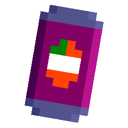

# Latin American needs... GRAPE SODA!

Repository of the game _"Latin American needs... GRAPE SODA!"_ created by [SavanDev (me!)](https://twitter.com/dylnavas36).

__For play the nightly version, enter [here!](https://savandev.gitlab.io/chesspawn/games/2021/grapesoda/)__

## Context

> One day, the news reaches you that in your country your favorite drink is going to be withdrawn from the market… grape soda.
>
> Your mission is to try to get the last units left in the stores before it disappears completely… but it will not come cheap.

## Build

For compile the game, __first__... you need:

- Install [Haxe](https://haxe.org/download/).
- Install [HaxeFlixel](https://haxe.org/download/).
- Install [Git](https://git-scm.com/) (only if you compile for desktop).

Later, you need install this __additional libraries__ (depending your target platform):

### For all platforms
> haxelib install flixel-addons

### For desktop
> haxelib install flixel-ui

> haxelib git discord_rpc https://github.com/Aidan63/linc_discord-rpc

Now for finally compiled the game, well... is exactly as [Friday Night Funkin](https://github.com/ninjamuffin99/Funkin#compiling-game) but I detail here anyway.

### Hashlink

- Download [Hashlink](https://github.com/HaxeFoundation/hashlink/releases).
- Decompress the zip (in a fixed folder).
- Run "lime setup hl" and follow the steps.
- In the root game folder, now run "lime test hl -debug".

And that's all.

### Windows/Linux

Detailed explication for [Windows](https://lime.software/docs/advanced-setup/windows/) and [Linux](https://lime.software/docs/advanced-setup/linux/).

Simply... in Windows run:

> lime setup windows

or in Linux:

> lime setup linux

and follow the steps.

Later, just run "lime test windows -debug" (on Windows) or "lime test linux -debug" (on Linux) in the root folder.

## Special credits

- "[__Toy__](https://arcade.itch.io/toy)" font made by [Void](http://frankqbe.tumblr.com/).
- Music made by [Joshua McLean](https://joshua-mclean.itch.io).

Both licensed under [Creative Commons Attribution 4.0 International](https://creativecommons.org/licenses/by/4.0/).